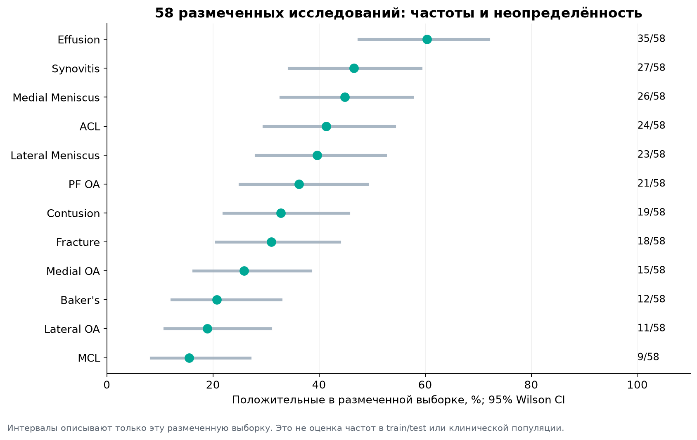
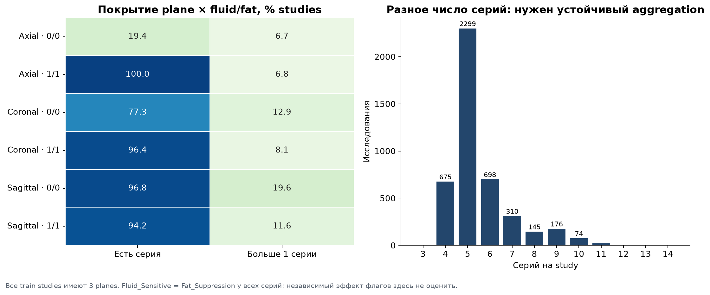
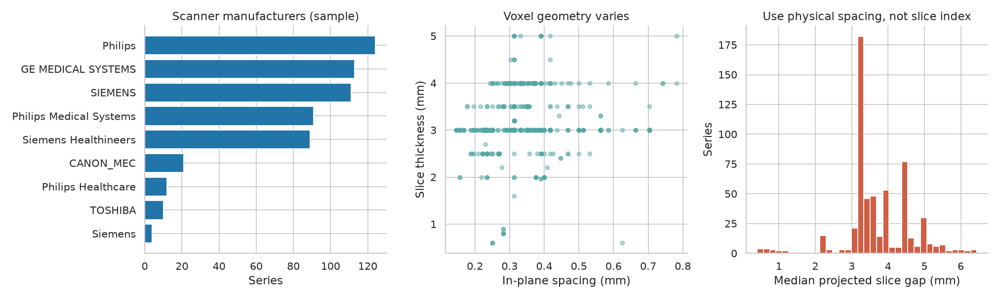
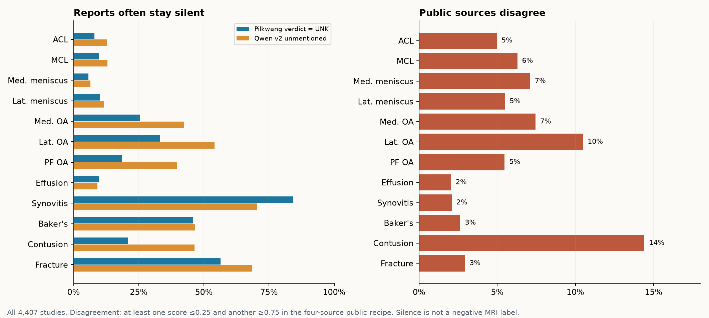
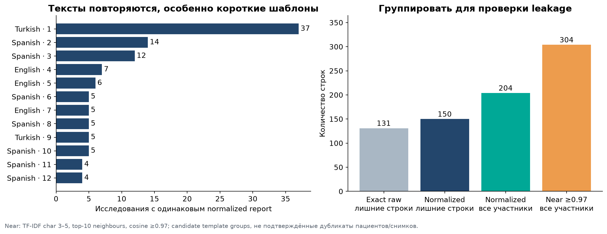

# EDA: что влияет на наши эксперименты

Исследование проводилось 6–7 октября 2026. Полностью разобраны inventory/таблицы train; подробная проверка пикселей и геометрии выполнена на выборке **99 исследований / 575 серий / 18 741 среза**. Отдельная подготовка training cache декодировала все **819 078 train-срезов** без unreadable slices. Это не означает ручной визуальный просмотр каждого изображения.

| Наблюдение | Что из него следует |
|---|---|
| 4407 train studies, 24 371 серии; только 58 studies имеют Gold, 4349 — без официальных меток | Основной supervised сигнал — weak labels из отчётов; качество меток может ограничивать модель |
| 3–14 серий на исследование, медиана 5 | Нужны missing-series masks и корректная агрегация переменного числа серий |
| В **1936/4407** исследованиях повторяются plane/protocol combinations | Выбор единственной серии может терять полезную информацию; проверить pooling повторных серий |
| Медиана длины серии — 30 срезов; диапазон inventory 11–320 | Длинные серии нельзя смешивать с короткими без контроля sampling и compute |
| В pixel audit spacing 0.1465–0.7813 mm; толщина 0.6–5 mm; физический шаг 0.4–6.447 mm | Соседние индексы означают разные физические расстояния; проверить windows с фиксированным шагом в mm |
| Несколько производителей, 1.5T/3T, разные разрешения и протоколы | Физический FOV, ориентация и protocol-stratified diagnostics важнее фиксации одного pixel crop |
| Имя DICOM-файла не задаёт надёжную анатомическую последовательность | Сортировать по физической позиции и ориентации; этот шаг уже реализован |
| Видимый test содержит только 3 демонстрационных studies | Его используют для проверки исполнения и CSV, не для оценки качества |

Это частоты именно 58 Gold, а не оценка prevalence всего train или hidden test.

В train флаги `Fluid_Sensitive` и `Fat_Suppression` совпадают; независимый эффект этих двух флагов здесь не оценить. Это совпадение не следует переносить на все новые test-протоколы.

Геометрия и производители на этом графике измерены в audit-выборке, не на полном pixel inventory.

## Где слабые метки спорят и молчат

При пороге 0.5 публичные источники расходятся примерно в **21.7%** исследований для Contusion и **16.0%** для Medial Meniscus. Наибольший средний разброс вероятностей — у Synovitis. Это диагностика таблиц меток, а не доказательство ошибок конкретного источника.

У Pilkwang **84.2%** Synovitis labels имеют статус unknown. Точная четырёхисточниковая консенсусная метка Synovitis даёт AUC около **0.798** против 58 Gold. Отсутствие упоминания в отчёте следует отличать от подтверждённого отсутствия патологии: masked loss или понижение confidence здесь — гипотеза для сравнения.

Steven v4 уже содержит Lixin, а текущий рецепт учитывает Lixin ещё раз. Нужно проверить консенсус без двойного учёта зависимого учителя. Замена Qwen v1 на v2 сама по себе не дала убедительного улучшения согласия меток с Gold: Δmacro AUC **−0.00342**, paired bootstrap 95% CI **[−0.01491; +0.00744]**. Это сравнение label extraction; оно не заменяет обучение и оценку image model.

Справа показана более строгая мера противоречия: хотя бы один источник ≤0.25 и другой ≥0.75. Числа выше в тексте относятся к расхождению классов после порога 0.5, поэтому доли различаются. Qwen v2 на этом графике исследован в EDA, но текущий training recipe использует v1.

## Дубли, тексты и validation

После нормализации найдены 54 группы одинаковых отчётов, охватывающие 204 исследования, и 59 групп похожих шаблонов, охватывающие 304 исследования. Один шаблон отчёта не доказывает одного пациента. Эти группы стоит использовать для stress checks и анализа конфликтов, а не автоматически превращать в patient IDs.

Есть разные языки отчётов и protocol signatures. Language hints не являются установленными site labels; мы не утверждаем, что ими можно точно восстановить клинику. В исследовании французские отчёты представлены 81 study, среди них нет Gold: это показывает ограниченность покрытия нашей маленькой контрольной выборки.

Самая редкая Gold-патология, MCL, имеет всего 9 положительных исследований. Поэтому 5-fold split на 58 Gold даёт крайне шумные AUC, а bootstrap описывает вариативность именно этой выборки. Частые tiny gains после многочисленных настроек на Gold нельзя считать независимой проверкой.

## Что уже прочитали в discussions

На **6 октября** выгружены все 161 доступные темы и 890 уникальных сообщений, включая 37 удалённых/пустых. Это полный snapshot на дату выгрузки; новые сообщения после неё требуют обновления.

- Для сильных публичных notebooks проверяли доступность assets, а не только score в названии. В проверенном наборе лучший воспроизводимый вариант с доступными inputs — GoodPJ 0.944; варианты 0.945–0.946 часто требовали приватные datasets. Это не утверждение, что прочитан каждый Kaggle notebook.
- Участники сообщали, что больше folds, больше inference slices, более крупный backbone или «исправленные» labels не всегда улучшали hidden score. Эти сообщения направляют ablations; это не независимые доказательства эффективности метода.
- Официальные ответы организаторов отделяли от мнений участников. Актуальные ограничения на внешние данные и готовые модели собраны в [RESEARCH.md](RESEARCH.md).

Новые experiments должны менять один фактор, сохранять сравнимый sampling и записывать per-class результаты. Первая цель — добавить информацию, которую текущий pipeline теряет, и найти модель с полезными отличиями в ошибках.
