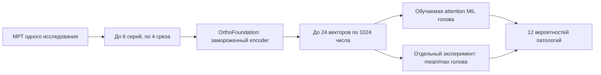

# Что именно сейчас запускаем

Это отдельный эксперимент рядом с завершённым ансамблем **0.944**.
Attention уже обучен: weak holdout AUC **0.7603**, Gold58 AUC **0.7361**.
На Gold он пока уступает нашему отдельному ConvNeXt (**0.9112**). Веса OrthoFoundation заморожены; с нуля обучаются небольшие
головы, которые превращают признаки срезов в 12 прогнозов на исследование.

Три плоскости × наличие/отсутствие подавления жира дают шесть слотов. В каждом
слоте берём одну серию с наибольшим числом доступных срезов и четыре позиции,
равномерно распределённые примерно между 4% и 96% серии. Отсутствующие слоты
маскируются. Повторные серии и остальные срезы в этот эксперимент не входят.

Один grayscale-срез повторяется в трёх входных каналах. Здесь соседние срезы
не упакованы как RGB: это отличается от 2.5D ConvNeXt в нашем baseline.
Из подготовленного изображения 384×384 вырезаем центральные 92% поля,
уменьшаем до 224×224 и применяем ImageNet normalization. Это наш выбранный
preprocessing, а не утверждение о точном повторении pretraining автора.

OrthoFoundation — MRI-pretrained DINOv3 ViT-L/16. Его 303 154 176 параметров
не обновляются. Из каждого среза сохраняется один CLS-вектор размерности 1024.
Используем проверенный авторский вариант forward без RoPE. Признаки сохраняем
один раз, чтобы дальнейшие сравнения голов обходились без повторного encoder.

Attention-голова содержит **369 816 обучаемых параметров**. Сначала она
преобразует каждый вектор 1024→256, добавляет embedding слота и позицию среза.
Для каждого из 12 диагнозов отдельно вычисляет веса срезов, складывает их
признаки с этими весами и выдаёт logit. Например, для ACL и Effusion модель
может использовать разные срезы. Это attention pooling; отдельного Transformer
между срезами в этой голове нет. Sigmoid превращает logits в вероятности.

Mean/max-голова — отдельное сравнение на том же банке признаков. Вместо
обучаемого выбора срезов она объединяет средний и максимальный векторы valid
срезов, затем выдаёт 12 logits. В ней **338 444 параметра**. Это пока не
проверенное улучшение и не готовый новый участник ансамбля.

Для каждой архитектуры предусмотрены две отдельные головы:

- Validation: 3 479 weak studies для обучения, 870 для holdout fold0.
- Production: все 4 349 weak studies для обучения; 58 Gold используются
  только для диагностики после фиксированных 12 эпох.

Настройки зафиксированы: BCEWithLogits на weak targets, AdamW, lr=0.001,
weight decay=0.01, cosine decay по шагам, batch=64, dropout=0.2, seed=42.
Gold не участвует в градиентах и выборе checkpoint. Лучший epoch по Gold
не выбирается. Weak AUC измеряет согласие с weak labels; Gold AUC считается
по экспертным меткам, но маленькая выборка ограничивает выводы.

Фактически завершили pilot, семь extraction jobs и полный merge+attention training.
Получили 4 407 уникальных исследований, 21 334 выбранные slot-series и 85 336 срезов.
Каждый merged feature проверен против исходных частей; обе обученные головы
повторно воспроизвели сохранённые predictions. Gold58 нигде не использован в градиентах.
[Результаты, ограничения и следующий шаг](ORTHO_RESULTS.md),
[фактический журнал](../experiments/orthofoundation_http_sharded_v2/STATUS.md).

Сейчас сравниваем mean/max на том же банке и готовим один заранее заданный
линейный Ridge probe с центрированием признаков отдельно по каждому слоту.
Он поможет отличить трудности attention-головы от ограничений frozen CLS-признаков.
Hyperparameters по Gold не подбираем. Новый leaderboard score не измеряли;
OrthoFoundation пока не входит в сабмит 0.944.
