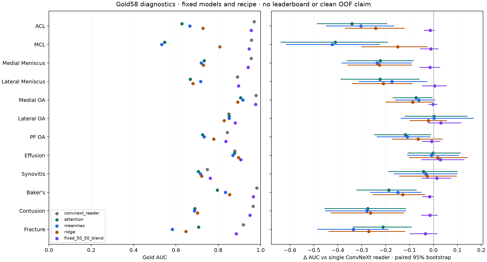

# OrthoFoundation: что действительно получили 7 октября

Взяли MRI-pretrained OrthoFoundation-L (DINOv3 ViT-L/16), заморозили encoder и
обучили attention и mean/max головы на 12 weak целей на Kaggle. Затем выполнили
один фиксированный CPU Ridge probe локально. Банк, все веса, нормализация и
прогнозы независимо проверены; реальных повторных fit при проверках не делали.

| Модель / рецепт | Weak holdout, 870 studies | Gold58 macro AUC |
|---|---:|---:|
| Наш отдельный ConvNeXt reader | Не измерен на этом split | 0.911160 |
| Frozen Ortho CLS + attention | 0.760328 | 0.736061 |
| Заранее заданный 50/50 ConvNeXt + attention | — | 0.908313 |
| Frozen Ortho + mean/max | 0.768476 | 0.735397 |
| Slot-centered Ridge probe | 0.775881 | 0.771916 |

Gold — 58 экспертно размеченных исследований. У полного ансамбля **0.944** нет
Gold predictions для этого сравнения: здесь reference — только один наш reader.
Его публичный warm start не имеет подтверждённой истории supervised exposure,
поэтому это диагностическое сравнение, не clean OOF и не ожидаемый leaderboard score.
Weak AUC отражает согласие с бинаризованными teacher labels, не экспертную точность.

Ridge Gold AUC: bootstrap95% **[0.7343, 0.8064]**; разница с reader
**−0.1392 [−0.1765, −0.1045]**. Attention Gold AUC: **[0.6915, 0.7784]**. Разница с reader:
**−0.1751 [−0.2183, −0.1311]**. Для фиксированного blend разница
**−0.00285 [−0.01616, +0.01092]**: статистически убедительного выигрыша нет.
Bootstrap парный по studies, 2000 repeats, seed42; веса blend заранее зафиксированы,
другие веса по Gold не искали. Отдельная слабая ветка может иметь отличающиеся
ошибки, но это ещё не делает её полезным участником ансамбля.

Фактически обработали **4 407 исследований / 21 334 слота / 85 336 срезов**.
Семь частей содержали 4 413 study partials: шесть studies пересекают границы shards,
при merge они объединены по непересекающимся slots. Feature shape [6,4,1024], FP16.
Все vectors конечные; присутствующие slots ненулевые, missing slots равны нулю.
Validation head: 3479 weak studies, 12epochs/660updates; production:4349weak,
12epochs/816updates. Gold gradients/checkpoint selection **0**.

Авторы OrthoFoundation сообщают downstream-результаты после **полного fine-tuning**.
Мы проверили другой, более дешёвый режим: frozen CLS и отдельную голову.
Поэтому слабый результат нашей ветки не опровергает результаты авторов.
[Закреплённый авторский README](https://github.com/ytrsk/OrthoFoundation/blob/4ae0a0aa1a5eedf578c1ec8db3e82bd9fac68470/README.md).

Результат пока слабый. Возможные ограничения выбранного эксперимента: только
четыре среза на серию, один global CLS вместо spatial patch tokens и полностью
замороженный encoder. Это гипотезы, а не доказанная причина. Признаки различаются
между studies; полной потери сигнала или тотального feature collapse не установлено.

Mean/max сравнение на **том же** банке и split завершено: weak AUC вырос на
0.00815, Gold практически не изменился. GPU повторно не использовался.
Ridge (alpha1000) дал weak0.7759/Gold0.7719: в признаках есть сигнал,
но ни один из трёх фиксированных readout не приблизился к нашему reader.
Статистики Ridge проверены независимо: только gradient IDs соответствующего
fit: 870 holdout исключены из CV scaler/model; production использует все4349
weak, включая бывший CV holdout. Gold исключён из обоих fit.
CPU parent9.021s, peak1.265GB.
Ridge меняет pooling, нормализацию и loss вместе, поэтому нельзя приписать
разницу только одному компоненту. Это диагностика представления.

Следующий план — в [EXP-OF-004 и других конкретных задачах](NEXT_EXPERIMENTS.md).
Сначала проверяем training/inference preprocessing на одном неизменном Linux
эталоне и делаем измеренный pilot fine-tuning верхних блоков. Если его бюджет
приемлем, сравниваем на том же weak fold до использования Gold. Отдельная
ветка — local ROI reader для менисков/ACL и более плотный sampling. Подбор
десятков голов на Gold58 не планируем.

Практическое решение: **Ortho пока не добавляем в ансамбль и не отправляем новый
экспериментальный сабмит**. Общий один submission собираем после результатов
наших веток и экспериментов тиммейта, который обучается в другом аккаунте.

Код/configs находятся в Git. Большие MRI, feature bank, attention/meanmax checkpoints и predictions
сохранены в приватных Kaggle outputs; маленькие Ridge weights/predictions —
в приватной локальной папке experiment execution. ссылка без sharing не даёт
другому аккаунту доступа. Для воспроизведения другу нужны доступ к inputs либо
его собственные эквивалентные datasets. Новые веса существуют фактически;
в Git публикуем hashes и доказательства, а не бинарные model assets.

[Actual Kaggle merge/training](https://www.kaggle.com/code/alanchoo/rsna-knee-ortho-http-merge-heads-v2) ·
[ROOT seal](../experiments/orthofoundation_http_sharded_v2/ROOT_actual_full_merge_seal.json) ·
[Independent audit](../experiments/orthofoundation_http_sharded_v2/merge_independent_full_validation.json) ·
[Aggregate diagnostic JSON](../experiments/orthofoundation_http_sharded_v2/gold_final_diagnostics/Gold_diagnostics.json)

[Actual meanmax](../experiments/orthofoundation_sharded_meanmax_http_v2/result_receipt.json) · [Actual Ridge](../experiments/orthofoundation_ridge_probe/independent_actual_Ridge_validation.json)
