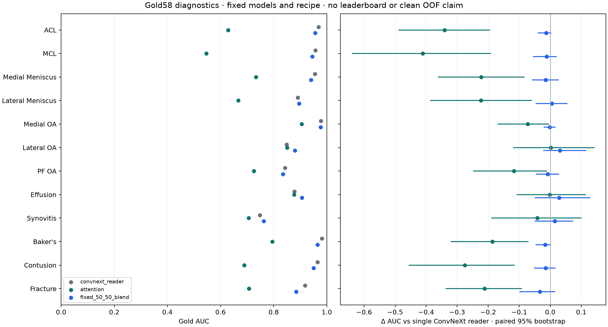

# OrthoFoundation: что действительно получили 7 октября

Взяли MRI-pretrained OrthoFoundation-L (DINOv3 ViT-L/16), заморозили encoder и
обучили свою attention MIL голову на 12 weak целей. Все этапы выполнены на Kaggle,
полный банк и обе головы проверены отдельно ROOT и независимым reviewer.

| Модель / рецепт | Weak holdout, 870 studies | Gold58 macro AUC |
|---|---:|---:|
| Наш отдельный ConvNeXt reader | Не измерен на этом split | 0.911160 |
| Frozen Ortho CLS + attention | 0.760328 | 0.736061 |
| Заранее заданный 50/50 ConvNeXt + attention | — | 0.908313 |
| Frozen Ortho + mean/max | 0.768476 | 0.735397 |
| Slot-centered Ridge probe | Код готовится, fit ещё не выполнен | — |

Gold — 58 экспертно размеченных исследований. У полного ансамбля **0.944** нет
Gold predictions для этого сравнения: здесь reference — только один наш reader.
Его публичный warm start не имеет подтверждённой истории supervised exposure,
поэтому это диагностическое сравнение, не clean OOF и не ожидаемый leaderboard score.
Weak AUC отражает согласие с бинаризованными teacher labels, не экспертную точность.

Attention Gold AUC: bootstrap95% **[0.6915, 0.7784]**. Разница с reader:
**−0.1751 [−0.2183, −0.1311]**. Для фиксированного blend разница
**−0.00285 [−0.01616, +0.01092]**: статистически убедительного выигрыша нет.
Bootstrap парный по studies, 2000 repeats, seed42; веса blend заранее зафиксированы,
другие веса по Gold не искали. Отдельная слабая ветка может иметь отличающиеся
ошибки, но это ещё не делает её полезным участником ансамбля.

Фактически обработали **4 407 исследований / 21 334 слота / 85 336 срезов**.
Семь частей содержали 4 413 study partials: шесть studies пересекают границы shards,
при merge они объединены по непересекающимся slots. Feature shape [6,4,1024], FP16.
Все vectors конечные; присутствующие slots ненулевые, missing slots равны нулю.
Validation head: 3479 weak studies, 12epochs/660updates; production:4349weak,
12epochs/816updates. Gold gradients/checkpoint selection **0**.

Авторы OrthoFoundation сообщают downstream-результаты после **полного fine-tuning**.
Мы проверили другой, более дешёвый режим: frozen CLS и отдельную голову.
Поэтому слабый результат нашей ветки не опровергает результаты авторов.
[Закреплённый авторский README](https://github.com/ytrsk/OrthoFoundation/blob/4ae0a0aa1a5eedf578c1ec8db3e82bd9fac68470/README.md).

Результат пока слабый. Возможные ограничения выбранного эксперимента: только
четыре среза на серию, один global CLS вместо spatial patch tokens и полностью
замороженный encoder. Это гипотезы, а не доказанная причина. Признаки различаются
между studies; полной потери сигнала или тотального feature collapse не установлено.

Mean/max сравнение на **том же** банке и split завершено: weak AUC вырос на
0.00815, Gold практически не изменился. GPU повторно не использовался.
Остался один заранее объявленный slot-centered/scaled Ridge probe (alpha1000).
Статистики нормализации Ridge считаются только на gradient IDs соответствующего
fit; Gold/holdout в них не участвуют. Encoder повторно не запускается.
Если другой readout существенно улучшит weak holdout, исследуем оптимизацию
головы. Если оба останутся слабыми, следующий содержательный эксперимент —
более плотный sampling или fine-tuning верхних блоков с заранее заданным split
и измеренным compute budget. Подбор десятков голов на Gold58 не планируем.

Практическое решение: **Ortho пока не добавляем в ансамбль и не отправляем новый
экспериментальный сабмит**. Общий один submission собираем после результатов
наших веток и экспериментов тиммейта, который обучается в другом аккаунте.

Код/configs находятся в Git. Большие MRI, feature bank, checkpoints и UID-level
predictions сохраняются в приватных Kaggle outputs; ссылка без sharing не даёт
другому аккаунту доступа. Для воспроизведения другу нужны доступ к inputs либо
его собственные эквивалентные datasets. Новые веса существуют фактически;
в Git публикуем hashes и доказательства, а не бинарные model assets.

[Actual Kaggle merge/training](https://www.kaggle.com/code/alanchoo/rsna-knee-ortho-http-merge-heads-v2) ·
[ROOT seal](../experiments/orthofoundation_http_sharded_v2/ROOT_actual_full_merge_seal.json) ·
[Independent audit](../experiments/orthofoundation_http_sharded_v2/merge_independent_full_validation.json) ·
[Aggregate diagnostic JSON](../experiments/orthofoundation_http_sharded_v2/gold_attention_diagnostics/Gold_diagnostics.json)
